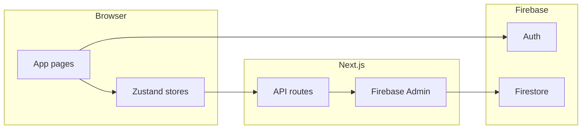

# Habit Rabbit — product and architecture overview

This document describes what the app is for, how users move through it, and where the important code lives. It complements the [README](../README.md) setup and convention sections.

## Purpose

Habit Rabbit is a **personal habit tracker**. You define **habits** as **sections**, append **updates** (short log lines with timestamps), and analyze activity through **list**, **frequency**, and **calendar** views. A dedicated **Fitness** area tracks workouts, cardio, and aggregates dashboards without changing the core “section + updates” model for other habits.

The UI is **mobile-first** and **dark-only**: a single zinc-based theme, accent colors for habit identity, and icon-first actions where it reduces clutter.

## Core concepts

### Sections (habits)

A **section** has an `id`, `title`, `colorKey` (for accent styling), and a list of **updates**. Sections are loaded and mutated through the sections API and global state in [`src/store/useSectionsStore.ts`](../src/store/useSectionsStore.ts).

Typical flows:

- Add a section via the floating action button on the home screen.
- Collapse/expand a section to scan many habits on small screens.
- Open the **Fitness dashboard** when the section id is `fitness` (link from the section header).

### Updates (log entries)

Each **update** has `id`, `text`, and `createdAt` (ISO string). Users add text from the bottom of each section card, edit inline (text and time), and delete with a short **undo** window (`DeleteToast` + pending delete state in the store).

Updates are grouped **by calendar day** in the list view (`groupUpdatesByDay` in [`src/lib/groupUpdatesByDay.ts`](../src/lib/groupUpdatesByDay.ts)).

### Views and settings

From the navbar **settings** menu:

- **View**: list, frequency chart, or calendar heatmap.
- **List layout**: horizontal scroll of cards or responsive grid; optional collapse/expand all.
- **Ranges**: calendar window and frequency window (see [`src/constants/viewOptions.ts`](../src/constants/viewOptions.ts)).
- **Sort**: by name, recency, or update counts (see [`src/constants/sortOptions.ts`](../src/constants/sortOptions.ts)).

Preferences are merged into the same Zustand store and persisted where configured (see `ViewSettingsPersistence`).

## Fitness feature

**Fitness** is a **separate document** in the backend: [`FitnessState`](../src/types/fitness.ts) holds `exercises` and `dayLogs` (per-day checkboxes, swim/run counts, selected muscle groups). It is loaded and saved via [`src/lib/api.ts`](../src/lib/api.ts) (`getFitness` / `updateFitness`) and the [`/api/fitness`](../src/app/api/fitness/route.ts) route.

The page [`src/app/fitness/page.tsx`](../src/app/fitness/page.tsx) orchestrates:

- **Day selection** and optional calendar sheet ([`DaySelector`](../src/components/fitness/DaySelector.tsx)).
- **Welcome** flow for choosing groups when today has no data ([`WelcomeScreen`](../src/components/fitness/WelcomeScreen.tsx)).
- **Daily template** of exercises by muscle group ([`WeeklyTemplate`](../src/components/fitness/WeeklyTemplate.tsx) — name is historical; it is the day editor).
- **Cardio** toggles ([`SwimRunInput`](../src/components/fitness/SwimRunInput.tsx)).
- **Dashboard** charts and KPIs ([`FitnessDashboard`](../src/components/fitness/FitnessDashboard.tsx)), with derived data in [`src/lib/fitnessDashboard.ts`](../src/lib/fitnessDashboard.ts) and optional client cache in [`src/store/useFitnessDashboardStore.ts`](../src/store/useFitnessDashboardStore.ts).

**Edit exercises** mode restructures the exercise catalog ([`ExerciseEditMode`](../src/components/fitness/ExerciseEditMode.tsx)); it does not replace the generic “updates” model used for other sections.

The **fitness** section on the home screen is still a normal section with updates; the dashboard link is a convenience route into the richer fitness document.

## Authentication and data flow

- [`AuthGate`](../src/components/AuthGate.tsx) and [`AuthContext`](../src/contexts/AuthContext.tsx) send unauthenticated users to `/login`.
- API handlers validate the session (see [`src/lib/apiAuth.ts`](../src/lib/apiAuth.ts)) and read/write user-scoped data in Firestore.
- Without Firebase configuration, development can use file-based or in-memory fallbacks (see README env section).

## Key file map

| Concern                                     | Location                                                                                                                                                                                                                                       |
| ------------------------------------------- | ---------------------------------------------------------------------------------------------------------------------------------------------------------------------------------------------------------------------------------------------- |
| Global layout, dark theme, Ant Design shell | [`src/app/layout.tsx`](../src/app/layout.tsx), [`src/components/AppThemeProvider.tsx`](../src/components/AppThemeProvider.tsx), [`src/constants/antdTheme.ts`](../src/constants/antdTheme.ts), [`src/app/globals.css`](../src/app/globals.css) |
| Home / sections UI                          | [`src/app/page.tsx`](../src/app/page.tsx), [`src/components/SectionCard.tsx`](../src/components/SectionCard.tsx), [`src/components/Navbar.tsx`](../src/components/Navbar.tsx)                                                                  |
| Sections API                                | [`src/app/api/sections/`](../src/app/api/sections/)                                                                                                                                                                                            |
| Fitness API                                 | [`src/app/api/fitness/`](../src/app/api/fitness/)                                                                                                                                                                                              |
| Types                                       | [`src/types/index.ts`](../src/types/index.ts), [`src/types/fitness.ts`](../src/types/fitness.ts)                                                                                                                                               |

## Summary

- **Sections + updates** = general habits and logs.
- **Views** = list / frequency / calendar with shared sorting and search.
- **Fitness** = additional structured state and dashboards, linked from the `fitness` habit card.
- **Dark UI** = one theme across Tailwind tokens, CSS variables, Ant Design `ConfigProvider`, and Recharts styling.

For setup, scripts, and contributor conventions, use the [README](../README.md).
